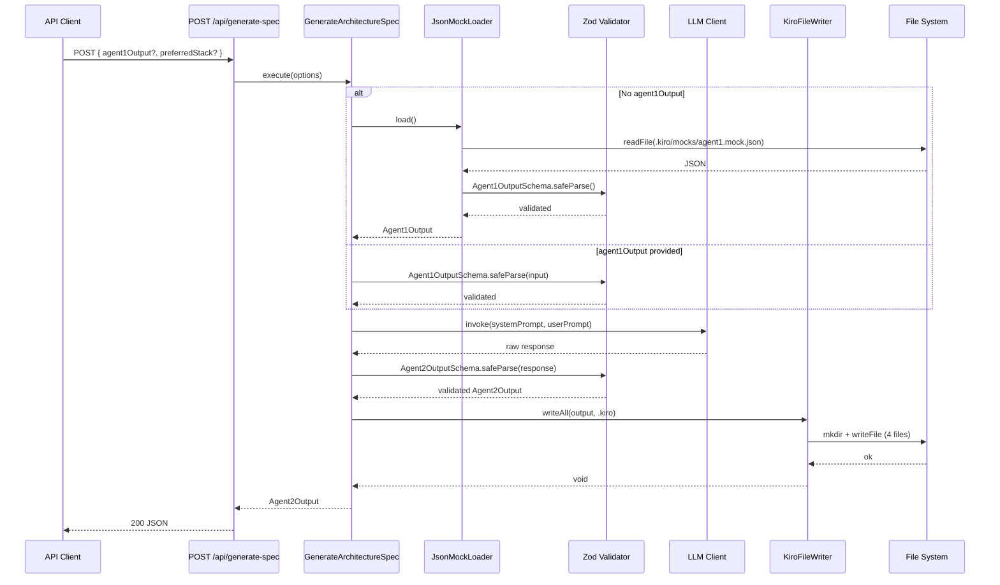

## Domain Entities

### Agent1Output

Properties:
- projectName: string (required)
- productVision: string (required)
- targetAudience: string (required)
- valueProposition: string (required)
- mvpFeatures: string[] (required)
- expectedMetrics: ExpectedMetrics (required)

Relationships: consumed by Agent2

### Agent2Output

Properties:
- techSteering: TechSteering (required)
- requirements: string (required)
- design: DesignOutput (required)
- tasks: TaskItem[] (required)

Relationships: persisted by KiroFileWriter

### TechSteering

Properties:
- stack: string[] (required)
- architecturePattern: Clean | Hexagonal (required)
- solidBoundaries: SolidBoundary[] (required)
- securityGuards: SecurityGuard[] (required)

Relationships: written to steering/tech.md

## Sequence Diagram

## IAM Policies

| Service | Actions | Resource | Effect |
| --- | --- | --- | --- |
| Lambda | lambda:InvokeFunction | arn:aws:lambda:us-east-1:*:function:kirospec-* | Allow |
| S3 | s3:GetObject, s3:PutObject | arn:aws:s3:::kirospec-specs/* | Allow |
| CloudWatch | logs:CreateLogGroup, logs:CreateLogStream, logs:PutLogEvents | arn:aws:logs:us-east-1:*:log-group:/aws/lambda/kirospec-* | Allow |

## AWS Cost Projection

### MVP

| Service | Monthly Cost (USD) |
| --- | --- |
| Vercel Pro (hosting + edge) | $20.00 |
| OpenAI API (GPT-4o, ~500 calls) | $15.00 |
| Vercel Postgres (starter) | $0.00 |
| CloudWatch Logs | $2.00 |

### Scale

| Service | Monthly Cost (USD) |
| --- | --- |
| Vercel Enterprise (hosting + edge) | $150.00 |
| OpenAI API (GPT-4o, ~50k calls) | $1500.00 |
| Vercel Postgres (pro) | $50.00 |
| CloudWatch Logs + Alarms | $25.00 |
| WAF + Shield | $30.00 |
